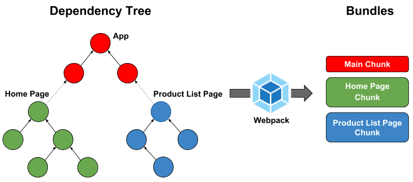

# Entry

## 🐇 Entry


[entry points](https://webpack.kr/concepts/entry-points/)는 웹팩이 웹 자원을 변환하기 위해 최초로 진입하는 자바스크립트 파일로, 해당 파일을 기준으로 모듈의 의존 관계를 분석하고 번들링한다. 때문에 엔트리 파일 안에는 대게 웹 애플리케이션의 전반적인 구조와 내용이 담겨있어야 한다. 별도의 설정을 하지 않을 경우 기본 값은 `./src/index.js` 이며 다른 또는 여러 엔트리 포인트를 지정할 수 있다.




## 🐇  Single Entry


단일 엔트리 구문은 SPA 같이 하나의 엔트리 포인트가 있는 애플리케이션을 구축하거나 웹팩 설정을 빠르게 진행하려는 경우 휼륭한 선택이지만, 설정을 확장할 수 있는 유연성은 다중 엔트리에 비해 다소 떨어지는 편이다.


```javascript
// webpack.config.js
module.exports = {
  entry: './src/index.js',
}
```

```javascript
// 단일 엔트리 구문은 아래 코드가 축약된 표현이다.
entry: {
  main: './src/index.js',
},
```

## 🐇 Object Entry


다중 엔트리 구문은 특정 페이지로 진입했을 때 서버에서 해당 정보를 내려주는 형태의 멀티 페이지 애플리케이션에서 유용하게 사용할 수 있으며 확장성이 좋은 편이다.


```javascript
// webpack.config.js
module.exports = {
  entry: {
    main: './src/MainView.js'
    login: './src/LoginView.js',
  }
}
```
