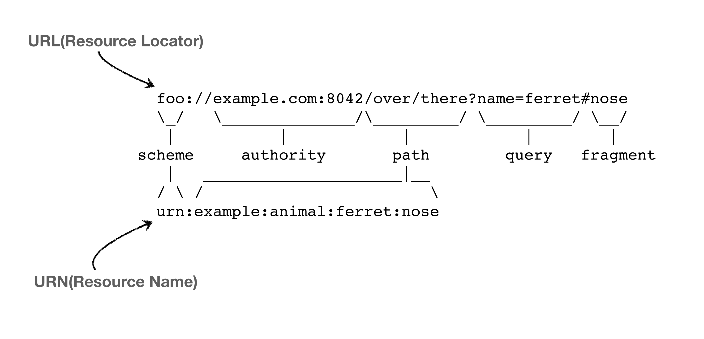

# Internet-network

## 인터넷을 실현하는 장비들

라우터, 스위치, 허브는 무엇이 다른가

어떤 원리로 동작하는지?

스위치와 라우터의 차이

ARP와 이더넷 프레

기본 지식1

1. 데이터는 작은 패킷으로 나뉘어 네트워크로 전송된다. (패킷이란? 패키지 + 버킷의 합성어)
2. 이 패킷에는 헤더가 있어서 이 헤더에 발신자 정보와 수령자 정보 등이 포함되게 된다.
3. 데이터를 패킷 형식으로 교환하는 이유는\
   1\. 네트워크 리소스 점유 시간이 줄어들어 나머지 컴퓨터들이 기다리게 되는 문제가 해결되고\
   2\. 경로상에 장애가 발생해도 다른 경로를 통해 전송하게 되므로 안정성이 높고\
   3\. 나누어진 패킷은 수서가 매겨지기 때문에 중간에 패킷이 유실되도 해당 패킷의 재요청이 가능하며 결과적으로 전체 데이터를 재전송하지 않아도 된다.
4. 단점으로는 모든 패킷에 대한 syn, ack 확인 과정이 추가되고, 모든 패킷에 헤더가 붙어야 하므로 오버헤드가 발생할 수 있다.

기본지식 2

1. 목적지의 포트번호를 알기 위해 브라우저는 우선 사용자가 입력한 도메인 값을 도메인과 포트번호를 매핑해놓은 테이블을 제공하는 도메인 네임서버(DNS)라고 하는 서버에서 찾는다.&#x20;

지기본지식 3&#x20;

프로토콜이란? 서로간에 데이터를 주고 받으려면 데이터가 이런 모양이어야 하고, 그 안에 IP, Port라는게 있어야 한다 와 같은 약속을 말한다. 인터넷은 실제 byte 데이터를 전달하면서 통신하며, 어떻게 통신할지 앞의 몇자리는 ip가 들어가고 나머지는 데이터가 들어간다 와 같은 약속이 필요하는데 이런 약속이 프로토콜인&#x20;

## IP 프로토콜 (Internet Protocol)

* 지정한 IP 주소에 데이터 전달
* 출발지 IP, 목적지 i데이터를 패킷이라는 통신 단위로 만들어 인터넷망에 전달하면 노드(라우터)끼리 어디가 제일 빠르게 처리할 수 있는 노드로 던지면서 목적지로 전달한다. (이 때 해커가 노드에 접속해서 데이터를 가로채고 해킹할 수도 있는데 이를 방지하기 위해 데이러를 암호화해서 전달하는 HTTPS를 사용할 것을 권장하는 것. 라우터 자체의 해킹은 제조사에서 내부적으로 이를 방지하기 위해 여러 시스템을 구축하고 있으며 cisco가 이런 보안 기술로 유명한 브랜드 중 하나이다.)

 (1).png>)

.png>)

IP 프로토콜의 한계

* 비연결성: 패킷을 받을 대상 서버가 없거나 서비스 불능 상태여도 패킷이 전송된다.
* 비신뢰성: 노드 장애, 다중 경로 라우팅 등에 의해 중간에 패킷이 유실되거나 지연 도착으 순서대로 전달이 안될 수 있다.
* 프로그램 구분: 같은 IP에서 여러 애플리케이션(음악들으면서 )을 사용한다면 어떻게 구분할지?
* 패킷 전달 순서 문제 발생: 패킷 용량이 너무 크면(1500bite?) 데이터를 여러개로 끊어서 보내게 되는데, 끊어서 보내진 데이터가 내가 원하는 순서와 다르게 보내질 수 있다.\
  (근데 이거는 사실 네트워크 계층의 헤더를 보면 프래그먼트 오프셋 등을 이용해 패킷 순서를 알 수 있는데, 이를 통해 수신측에서 데이터의 순서나 추가 데이터가 있는지 등을 파악하고 쪼개진 패킷들을 원래 순서에 맞게 재조립 할 수 있음 => 강의에서는 생략 )

\=> 여튼 이런 문제를 해결하기 위해서 만들어진게 TCP 프로토콜이다.

## TCP 프로토콜 (feat.  UDP )

.png>)

.png>)

.png>)

* IP 패킷에 뭔가 살짝 더해서 부족한 정보를 보완해주는 역할로 '전송 제어 프로토콜'이라고 한다.
* 즉 전송을 어떻게 할지에 대해 제어하는 역할을 한다.
* 신뢰할 수 있는 프로토콜로, 대부분의 어플리케이션에서 사용하고 있다.

&#x20;TCP 대표 특

* 연결지향: 연결이 되어 있어야 메세지를 보냄 // (TCP 3 way handshake, 가상연) => 서로 연결이 되어 있는지, 데이터를 보내도 되는 상황인지 확인하는 과정, 응답이 없으면 보내지 않는다. 요즘에는 최적화가 돼서 3번 애크를 보낼 때 데이터도 같이 전송하기도 한다.  // 근데 여기서 알아야 게 실제로 물리적으로 연결이 된거는 아니고 개념적으로 연결이 된거다.(즉  직접 연결이 아닌 간접 연결이라는 뜻은 선으로 직접 연결한게 아니라 노드를 통해 연결할 수 있음을 확인했다는 뜻이고 따라서 연결을 확인했음에도 중간 노드의 결함 등으로 연결이 유효하지 않게 될 수 도 있다.) 그리고 3 핸드쉐이크 단계에서는 TCP/IP 패킷 중 헤더 부분만 전송된다. (3단계에서 헤더 + 데이터 부분이 함께 전송되는 ) .png>)
* 데이터 전달 보증: 패킷이 중간에 누락되면 중간에 알 수 있다. 데이터를 전송하면 서버에서 데이터를 잘 받았다고 전달해

.png>)

* 순서 보증: 순서가 잘못 도착하면 내부적으로 최적화에 따라 조금 다를 수는 있겠지만 일반적으로 잘못 보내진 순서의 데이터부터 다시 보내라고 요청한다. 또는 아마도(?) 내부에 버퍼가 있어서 일정 시간 동안은 잘못된 순서를 맞출 것으로 예.

 (2).png>)

그 렇다면 TCP와 같은 계층에 존재한다는 UDP는 뭘까?&#x20;

* 사실 TCP와 달리 기능이 거의 없다. (그래서 하얀 도화지에 비유되기도 함)
* 일단 위에서 언급한 TCP기능은 모두 지원하지 않는다.
* PORT정도만 추가되었다고 보면 된다. (+ 체크섬)\
  참고로 PORT는 컴퓨터에 여러 어플리케이션을 이용하고 있을 때(음악들으면서 채팅 등) 하나의 IP만을 가지고 있는 내 PC로 패킷이 오면 어떻게 처리할지를 알려주는 역할을 한다. (해당 패킷을 음악 어플리케이션에서 사용할지, 채팅어플리케이션에서 사용할) // 체크섬은 메세지가 제대로 왔는지 정도만 검증해주는 역할을 한다.
* 따라서 데이터 전달 및 순서가 보장되지는 않지만 데이터가 단순하고 빠르다는 장점이 있다.
* TCP는 이미 기본적으로 구축되어 있는 기능들이 많아서 최적화하기 힘든데, UDP는 거의 구축이 되어있는게 없기 때문에 커스텀 작업을 통해 최적화해서 사용할 수 있다.
* 거의 TCP가 많이 쓰이고 있긴 하지만, 최근에는 UDP가 다시 각광받고 있는데 왜냐하면 웹브라우저에서 통신할 때 사용하는 최근 HTTP 3 버전에서 3 핸드쉐이킹 같은것들을 줄여서 더 최적화하자는 취지에서 UDP 프로토콜을 사용하고 있다.   &#x20;

추가지식 1

&#x20;데이터 전달이 종료되면 연결 해제를 위해 4 way handshake 과정을 거친다.

추가 지식 2

통신을 구현할 때 TCP와 UDP  선택해서 사용할 수 있다.

웹 개발은, 브라우저 위에서 동작하기 때문에 통신 프로토콜을 선택하는 자유도가 많이 떨어집니다.\
서버와 브라우저가 서로 통신하며 HTTP 최신 규격을 사용할지 여부를 결정하고, 이 규격에 따라 TCP만 사용할지 UDP도 사용할지가 결정됩니다. HTTP 최신규격인 HTTP/3 는 UDP를 이용한 데이터 전송을 주력으로 통신속도 향상을 꾀하는 것이 주된 목적이고 구글이 주도적으로 표준을 정립하고 있습니다.

추 가지식 3

대부분 서버는 공인 IP를 사용할테니 찾아가는데 문제가 없음&#x20;

클라이언트 즉, 일반적인 인터넷 사용자는 통신사에서 할당한 공인 IP 에 내부 IP 를 받아 사용하므로 서버에서 클라이언트에 패킷을 보낼 때 주소를 찾아가기 위해 클라이언트가 요청할 때 출발지 IP 정보에 mac address까지 포함시켜 전송한다.

추 가지식 4

tcp 3 way handshake의 성공에 대한 결과 => 서버와 클라이언트의 연결이 성공합니다.

내부에 IP, PORT 정보등이 기록됩니다. 그리고 이렇게 연결이 성공한 곳으로 데이터를 서로 흘려보냅니다.

사전지식 1

모 프로그램에 자동으로 포트가 할당되지 않고, 해당 프로그램에서 네트워크 통신을 위해 소켓을 사용하게 될 때 포트를 할당하게 다. (소켓 프로그래밍으로 검색해보기 )

## Port

&#x20;항구

한 번에 둘 이상 연결해야 한다면?

