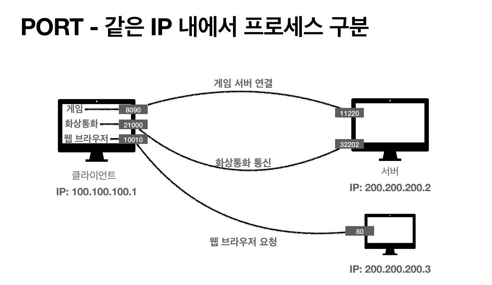

# Internet-network

## 인터넷 장비들

* 라우터, 스위치, 허브, 공유기는 무엇이 다른가?
* 어떤 원리로 동작하는가?
* 스위치와 라우터의 차이
* ARP와 이더넷 프레임

## IP 프로토콜 (Internet Protocol)


지정된 IP 주소에 패킷이라는 통신 단위로 데이터를 전달하는 역할을 한다. 예를 들어 출발지, 목적지 IP 정보를 담은 데이터를 패킷으로 변환 후 인터넷망에 던지면 제일 빠르게 처리될 수 있는 노드(라우터)로 전달되면서 최종 목적지로 도착하게 된다. (이 때 해커가 노드에 접속해서 데이터를 가로챌 수 있는데 이를 방지하기 위해 데이터를 암호화해서 전달하는 HTTPS를 사용할 것을 권장하고 있다. )


 (1).png>)

.png>)

#### 프로토콜이란?

인터넷은 실제 바이트로 된 데이터를 전달하면서 통신하며, 어떻게 통신할지, 예를 들어 앞의 몇자리는 IP Port가 들어가고 나머지는 데이터가 들어가야 한다.'와 같은 약속이 필요한데 이런 약속을 프로토콜이라고 한다.

#### 패킷이란?

1. 데이터는 작은 패킷(패키지 + 버킷)으로 나뉘어 네트워크로 전송된다.
2. 이 패킷에는 헤더와 바디가 있는데, 헤더에 발신자 정보와 수령자 정보 등이 포함된다.
3. 데이터를 패킷 형식으로 교환하는 이유는\
   1\. 네트워크 리소스 점유 시간이 줄어들어 나머지 컴퓨터들이 기다리게 되는 문제가 해결되고\
   2\. 경로상에 장애가 발생해도 다른 경로를 통해 전송하면 되므로 안정성이 높고\
   3\. 나누어진 패킷은 순서가 매겨지기 때문에 중간에 패킷이 유실되도 해당 패킷의 재요청이 가능하며 결과적으로 전체 데이터를 재전송하지 않아도 된다.
4. 단점으로는 모든 패킷에 대한 syn, ack 확인 과정이 추가되고, 모든 패킷에 헤더가 붙어야 하므로 오버헤드가 발생할 수 있다.

#### IP 프로토콜의 한계

* **비연결성:** 패킷을 받을 대상 서버가 없거나 서비스 불능 상태여도 패킷이 전송된다.
* **비신뢰성:** 노드 장애, 다중 경로 라우팅 등에 의해 중간에 패킷이 유실되거나 지연 도착으 순서대로 전달이 안될 수 있다.
* **프로그램 구분:** 같은 IP에서 여러 애플리케이션(음악들으면서 )을 사용한다면 어떻게 구분할지?
* **패킷 전달 순서 문제 발생:** 패킷 용량이 너무 크면(1500byte) 데이터를 여러개로 끊어서 보내게 되는데, 끊어서 보내진 데이터가 내가 원하는 순서와 다르게 보내질 수 있다.\
  (근데 이거는 사실 네트워크 계층의 헤더를 보면 프래그먼트 오프셋 등을 이용해 패킷 순서를 알 수 있는데, 이를 통해 수신측에서 데이터의 순서나 추가 데이터가 있는지 등을 파악하고 쪼개진 패킷들을 원래 순서에 맞게 재조립 할 수 있음 => 강의에서는 생략 )

\=>  IP 프로토콜의 한계를 해결하기 위해 TCP 프로토콜이 만들어 졌다.

## TCP 프로토콜 (feat. UDP )


IP 패킷에서 부족한 정보를 보완해주는 역할로 '전송 제어 프로토콜'이라고 한다. 즉 전송을 어떻게 할지에 대해 제어하는 역할을 한다. 신뢰할 수 있는 프로토콜로 대부분의 어플리케이션에서 사용하고 있다.&#x20;


.png>)

.png>)

.png>)

#### &#x20;TCP 특징

* **연결지향:** 연결이 되어 있어야 메세지를 보낸다.(TCP 3 way handshake, 가상연결)\
  클라이언트와 서버가 서로 연결이 될 수 있는지, 데이터를 보내도 되는지 미리 확인하는 과정으로 서버에서 응답이 없으면 클라이언트는 요청을 보내지 않는다. 총 3번의 연결 과정을 거치는데 이를 TCP 3 way handshake라고 하며 이 과정에서는 TCP/IP 패킷 중 헤더 부분만 전송된다. 요즘에는 최적화가 되어 있어서 3번째 ACK 신호를 보낼 때 데이터를 함께 전송하기도 한다. (이 연결은 간접 연결이므로 연결을 확인했음에도 노드의 결함 등으로 연결이 유효하지 않게 될 수 도 있다.)&#x20;

.png>)

* **데이터 전달 보증:** 데이터를 전송하면 서버에서 데이터를 잘 받았다고 전달해주므로 패킷이 누락되더라도 중간에 알 수 있다.

.png>)

* **순서 보증:** 패킷이 **** 잘못된 순서로 도착하면 내부 최적화에 따라 잘못 보내진 순서의 데이터부터 다시 보내라고 요청한다. 또는 내부 버퍼에 잘못된 순서로 도착한 패킷을 일정 시간 동안 보관해주는 식으로 순서를 보장해준다.

 (2).png>)

웹 초창기에는 웹사이트에 접속할 때 이미지, CSS 등 모든 데이터에 3-way handshake를 해야 했기에 효율이 매우 나빴다. 그래서 HTTP/1.1 부터는 '지속 연결 상태' 라는 개념을 도입하여 모든 바이트에 3-way handshake를 하는 것이 아니라 최초에 핸드쉐이크를 하고 이후에는 계속 연결을 유지하는 방식을 도입하였다. (모든 연결이 끝났을때 헤더에 연결 종료를 알림으로써 TCP 연결을 끊음)

또한 이 HTTP 지속 연결 상태를 기반으로 HTTP 파이프라이닝 이라는 기술도 같이 적용되었다. 이는 한번 연결된 TCP 연결을 기반으로 여러개의 요청을 '병렬' 요청함으로써 FIFO 방식 처리의 단점인 지연 문제를 해결해준다.&#x20;

이후 HTTP/2.0 에서는 최초 TCP 연결 이후 스트림 방식으로 여러 요청을 처리하는 멀티플렉싱 기능을 도입하여 더욱 속도 향상을 이루었고, HTTP/3.0에서는 아예 TCP가 아닌 UDP 방식으로 데이터를 전송함으로써 3-way handshake를 아예 하지 않아도 되는 식으로 발전하고 있다.

#### 그렇다면 TCP와 같은 계층에 존재하는 UDP는 뭘까?&#x20;

UDP는 TCP와 달리 기능이 거의 없다. 그래서 하얀 도화지에 비유되기도 한다. 일단 위에서 언급한 TCP기능은 모두 지원하지 않는다. IP단계에서 PORT와 체크섬 정도만 추가되었다고 보면 된다. 참고로 PORT는 컴퓨터에 여러 어플리케이션을 이용하고 있을 때(음악들으면서 채팅 등) 하나의 IP만을 가지고 있는 내 PC로 패킷이 도착하면 어떻게 처리할지를 알려주는 역할을 한다. (음악 어플리케이션에서 사용할지, 채팅어플리케이션에서 사용할지)  체크섬은 메세지가 제대로 왔는지 검증해주는 역할을 한다. 따라서 데이터 전달 및 순서가 보장되지는 않지만 데이터가 단순하고 빠르다는 장점이 있다.&#x20;

TCP는 이미 기본적으로 구축되어 있는 기능들이 많아서 최적화가 힘든데, UDP는 거의 구축이 되어있는게 없기 때문에 커스텀 작업을 통해 최적화해서 사용할 수 있다. 최근 HTTP 3 버전에서 3 way handshake 같은 단계(데이터 전달이 종료되면 연결 해제를 위해 4 way handshake 과정 거친다.)를 줄여서 더 최적화해보자는 취지에서 UDP 프로토콜을 사용하고 있다. 때문에 지금까지 TCP가 많이 쓰이고 있긴 하지만, 최근에는 UDP가 다시 각광받고 있다.&#x20;

참고로 통신을 구현할 때 TCP와 UDP 중 선택해서 사용할 수 있다. 웹 개발은 브라우저 위에서 동작하기 때문에 통신 프로토콜을 선택하는 자유도가 많이 떨어진다. 서버와 브라우저가 서로 통신하며 HTTP 어떤 규격을 사용할지 결정하고, 이 규격에 따라 TCP만 사용할지 UDP도 사용할지가 결정된다. HTTP 최신 규격인 HTTP/3은 UDP를 이용한 데이터 전송을 주력으로 통신속도 향상을 꾀하는 것이 주된 목적이고 구글이 주도적으로 표준을 정립하고 있다.

## Port


하나의 IP 내에 존재하는 여러개의 프로세스를 각 구별하기 위한 식별자로 포트 번호는 OS가 관리하며 여러개의 포트번호는 중복될 수 없다. 만약 한 PC에서 웹서버를 두 개 띄울 경우 A웹서버가 80번 포트를 사용한다면 B 웹서버는 8080 등 임의의 다른 포트를 지정하여 사용해야 한다. 서버쪽 포트 번호는 개발자가 포트 포워딩을 통해 몇 번 포트를 열어둘지 결정하거나 관례적으로 정해진 포트를 사용한다. 클라이언트에서는 남은 포트 중 랜덤으로 할당된다. 예로 웹에서 두개의 탭으로 나눠 유튜브와 네이버를 한다고 하면 클라이언트는 임의의 포트를 만들어서 각각에 연결한다.


#### 특정한 쓰임새를 위해서 IANA에서 할당한 TCP 및 UDP 포트 번호의 일부

* 0번 \~ 1023번 : 잘 알려진 포트 ( well-known port )
* 1024번 \~ 49151번 : 등록된 포트 ( registered port )
* 49152번 \~ 65535번 : 동적 포트 ( dynamic port )
* FTP: 20, 21
* TELNET: 23
* HTTP: 80
* HTTPS: 443

대부분의 포트는 그 번호가 지정되어 있기에 생략 가능한 경우가 많다. 그러나 서버가 임의의 포트에 서비스를 등록한 경우, 반드시 그 포트 번호를 명시해야 접속이 가능합니다. 예를 들면 데이터베이스는 보통 3306 포트를 사용한다. 그러나 이는 표준이 아니기에 대부분의 데이터베이스 접속시 포트번호를 반드시 명시해야 접속이 가능합니다. 웹은 기본적으로 80포트를 이용하는 것이 관례이다. 그래서 HTTP 요청이면서 별도의 포트를 지정하지 않을 경우 80번 포트로 접속을 시도하게 된다. 예를 들어 원래는 inflearn.com:80 으로 입력해야 하지만 포트 번호를 생략하로도 정상적으로 사이트에 접속할 수 있다.

## DNS


앞서 말한 IP는 사람이 기억하기 어렵다는 한계를 가지고 있다. 또한 IP는 변경될 수 있다. 도메인 네임 시스템은 IP주소에 사람이 인식하기 쉬운 이름을 붙여주는 것을 말한다.


 (2).png>)

#### DNS iterative query

우리가 어떤 URL(www.example.com)을 입력하면, 가장 먼저 내 위치에서 가까운 로컬 DNS에 IP주소를 질의(query)한다. 로컬 DNS 내부에 URL과 매칭되는 IP 주소가 캐싱되어 있지 않다면 로컬 DNS는 루트 DNS로 해당 도메인의 IP주소를 질의한다. 루트 DNS 에서도 알지 못하면 .com 을 관리하는 DNS 서버에 질의 한다. 이런식으로 최종 IP 주소를 획득할 때까지 질의를 반복합니다.&#x20;

