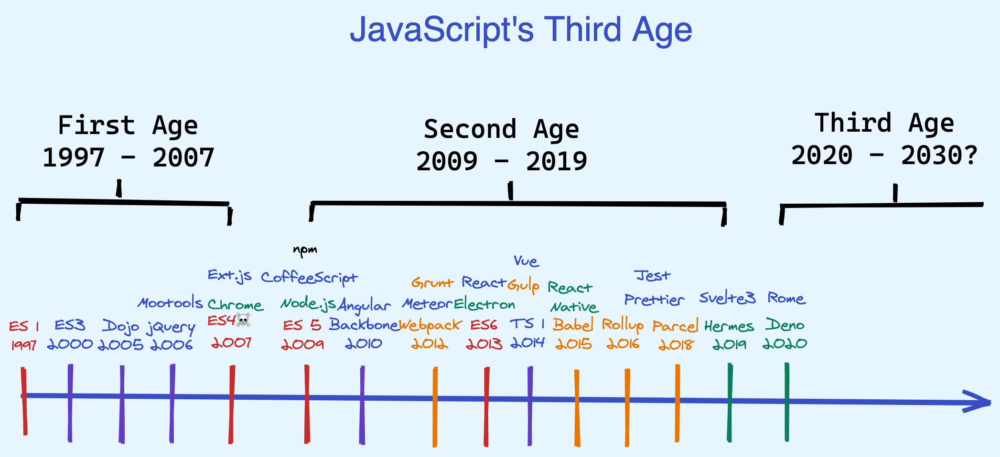

# Version

## 🐇 첫번째 주기(1997\~2007)


첫 등장으로 동적인 웹 개발이 시작되었으며 언어적인 측면의 완성을 위해 노력했던 시기. ES3을 통해 조금씩 대중적인 인기가 생기기 시작했으나 ES4를 실패한 후 긴 시간동안 정체기에 머물게 된다.


## 🐇 두번째 주기(2009\~2019)


언어로써의 영역을 확장시키 위해 노력한 시기. 오늘날 생태계 핵심을 이루는 Node, NPM, Transpiler, build, bundler, 다양한 프레임워크가 등장하며 도약한다.


* **2015년** ES6 (let, const, class, arrow function, template literal, destructuring assignment, spead, rest parameter, symbol, promise, iterator/generator, module, default parameters)
* **2016년** ES2016 (지수연산자, Array.prototype.includes, String.prototype.includes)
* **2017년** ES2017 (async/await, Object.values/entries, Object.getOwnPropertyDescriptors, trailing commas in function parameter lists and calls, async functions)
* **2018년** ES2018 (Object rest/spread, promise finally, async iteration, 정규표현식 강화)
* **2019년** ES2019 (Object.fromEntries, Array.prototype.flat, Array.prototype.flatMap, String.prototype.trimStart/trimEnd/trimLeft/trimRight, optional catch, Symbol.description)

## 🐇 세번째 주기(2020\~2030)


레거시 영역의 정리, 여러 도구로 인해 형성된 레이어의 제거가 이뤄질 것으로 예측, CommonJS/AMD(RequireJS)와 같은 비표준적 모듈 사용에 의존하는 수많은 생태계가 ECM 모듈로 전환될 것으로 예측, 타입 사용을 통한 성능 향상(TypeScript, Rust ) &#x20;


* **2020년** ES2020 (String.prototype.matchAll)
* **2021년** ES2021 (String.prototype.replaceAll, Promise.any(), WeakRef, ??=, ||=, &&=,1\_000  )
* **2022년** ES2022 (Class Field(private, static), Top level await, at, Object.prototype.hasOwn(), Error Cause)
