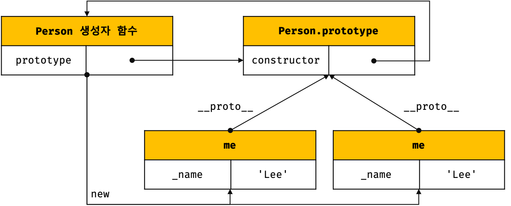

# Before-ES6

## 🐇 ES6 이전 클래스


자바스크립트 클래스의 핵심 기능은 프로토타입 상속이다. 두 객체가 같은 프로토타입에서 프로퍼티를 상속받는다면 이들을 같은 클래스의 인스턴스이다.  ES6 이전, class 키워드 없이 클래스를 만들던 방법들을 살펴보면서 클래스 내부에서 어떤 일이 일어나는지 이해해보자.


## 🐇 Object.create()


프로토타입 객체를 정의하고, Object.create()로 해당 프로토타입을 상속받는 객체를 생성한다면 자바스크립트 클래스를 정의한 것이다. 다음은 생성자를 정의하지 않았기에 널리 쓰이는 방법은 아니나, 클래스를 정의하는 가장 단순한 방법의 예시이다.


```
// 새 객체를 반환하는 팩토리 함수
function range(from, to) {
  let obj = Object.create(range.methods); // 프로토타입 프로퍼티 (상속o)
  obj.from = from;  // 이 객체의 고유한 프로퍼티(상속x)
  obj.to = to;      // 이 객체의 고유한 프로퍼티(상속x)
  return obj;
}

// 프로토타입 객체 정의
range.methods = {
  includes(x) {return this.from <= x && x <= this.to},
  *[Symbol.iterator]() {
    for(let x = Math.ceil(this.from); x <= this.to; x++) yield;
  },
  toString() {return `${this.from}~${this.to}`},
}

let obj = range(1, 3);
obj.includes(2);   // true
obj.toString();    // '1~3'
[...obj];          // [1, 2, 3]
```

## 🐇 생성자 함수


생성자 함수는 new 키워드를 통해 새로 생성된 객체를 초기화하는 역할을 하며, 클래스의 공개적인 부분을 담당한다. function 키워드로 생성한 함수는 모두 prototype 프로퍼티를 가지고 있고, 이 프로퍼티 값은 new 키워드를 통해 생성된 새 객체의 프로토타입으로 사용된다. 모든 객체에 프로토타입이 있지만 prototype 프로퍼티를 가진 객체는 그 중 일부인데, 명확히 말하자면 prototype 프로퍼티를 가지는 것은 함수 객체이다. 생성자 함수를 공유하는 객체는 모두 같은 객체를 상속하며 같은 클래스의 멤버이다.


```
// 생성자를 사용한 객체 초기화
function Range(from, to) {
  this.from = from;
  this.to = to;
}
  
// prototype 프로퍼티 상속
Range.prototype = { 
  constructor: Range, // 기존 prototype을 덮어쓰므로 생성자 역참조를 직접 만들어야 한다.
  includes(x) {return this.from <= x && x <= this.to},
  *[Symbol.iterator]() {
    for(let x = Math.ceil(this.from); x <= this.to; x++) yield;
  },
}

// 기존 prototype을 전부 덮어쓰지 않으려면 아래와 같이 하나씩 추가해야 한다.
Range.prototype.toString = function() {return `${this.from}~${this.to}`}

let obj = new Range(1, 3);
obj.includes(2);  // true
obj.toString();   // '1~3'
[...obj];         // [1, 2, 3]
```


**new.target**

함수 바디 안에서 new.target을 사용하면 해당 함수가 생성자로 호출되었는지 알 수 있다. 값이 undefined가 아니라면 해당 함수는 new 키워드와 함께 호출된 생성자 함수이다. 이때 new.target이 항상 생성자를 참조하는 건 아니며, 서브클래스의 생성자 함수를 참조할 수도 있다. new.target이 undefined라면 이 함수는 new 키워드 없이 함수로 호출된 것이다. 자바스크립트 에러 생성자는 new 없이 호출될 수 있는데, 다음과 같은 방법으로 직접 작성한 생성자도 new 키워드 없이 생성자를 호출시킬 수 있다.


```
function C() {
  if(!new.target) return new C();  // new 키워드 붙여서 다시 호출
  // 초기화 코드
}
```

## 🐇 instanceof


생성자 함수에서는 서로 다른 생성자 함수의 prototype 프로퍼티가 같은 프로토타입 객체를 참조할 수 있다. 그리고 두 생성자가 같은 클래스의 인스턴스를 초기화 할 수 있다. 엄밀히 말해 instanof 연산자는 obj 객체가 Range 생성자를 통해 초기화 됐는지는 체크하지 않는다. 이 연산자는 obj가 Range.prototype을 상속받는지만 체크한다.&#x20;


```
function Strange() {}
Strange.prototype = Range.prototype;
new Strange() instanceof Range;  // true
```

## 🐇 isPrototypeOf()


생성자 함수가 아닌 Object.create() 등을 통해 클래스를 정의한 경우 instanceof로 해당 객체의 프로토타입 체인에 특정 프로토타입이 존재하는지 테스트할 수 없는데, 이 때 isPrototypeOf() 메서드를 사용하여 해결할 수 있다.


```
range.methods.isPrototypeOf(obj); // true
```

## 🐇 생성자 프로퍼티


&#x20;생성자 함수를 호출할 때는 prototype 프로퍼티가 필요하므로 일반적인 자바스크립트 함수는 모두 자동으로 prototype 프로퍼티를 갖는다. 이 프로퍼티의 값은 열거 불가인 constructor 프로퍼티 단 하나이다. constructor 프로퍼티의 값은 함수 객체이다. constuctor 프로퍼티를 가진 미리 정의된 프로토타입 객체가 존재한다는 것은 그 객체가 일반적으로 자신의 생성자를 참조하는 constructor 프로퍼티를 상속받는다는 의미이다.&#x20;




```
let Func = function() {};     // 함수 객체
let Proto = Func.prototype;   // 프로토타입 객체
let Cons = Proto.constructor; // 프로토타입에 연결된 함
Cons === Func;                // true: 프로토타입에서 construct로 생성자를 역참조한다.
```

