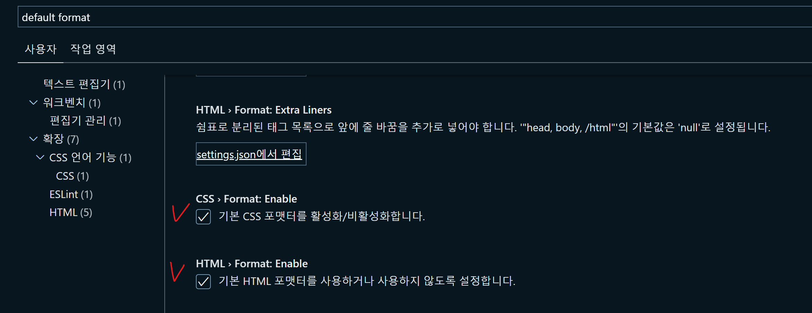

# Prettier

* [Prettier 공식문서](https://prettier.io/docs/en/index.html)

## 🐇 Prettier란?

## 🐇 Prettier 적용 안될 때

1. `ctrl + shift + p`로 설정에 들어간다.
2. `default format` 을 검색해서 `prettier`가 선택 되었는지 확인한다.

3\. html, css 포맷터를 활성화 했는지 확인한다.

